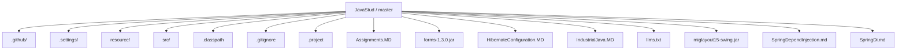
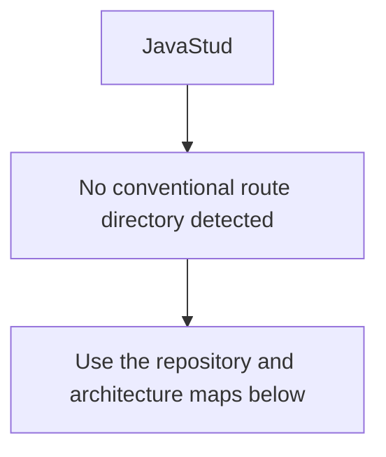
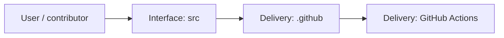
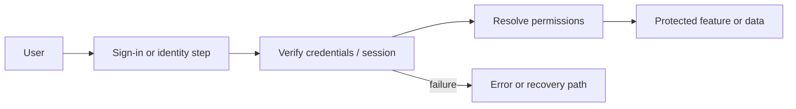
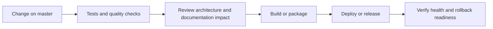
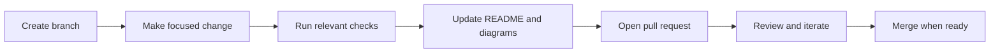

<!-- interactive-readme-standard:start -->

# JavaStud

**Branch-aware technical guide for [`master`](https://github.com/Nischhalsubba/JavaStud/tree/master)**

  

  <a href="https://github.com/Nischhalsubba/JavaStud/tree/master"><strong>Browse source</strong></a> ·
  <a href="https://github.com/Nischhalsubba/JavaStud/issues"><strong>Issues</strong></a> ·
  <a href="https://github.com/Nischhalsubba/JavaStud/codespaces/new?ref=master"><strong>Open in Codespaces</strong></a>

> [!IMPORTANT]
> This guide is generated from the files actually present on `master`. It links to detected source paths, preserves project-authored notes, and avoids claiming components that were not found.

## At a glance

| Item | Detected value |
|---|---|
| Purpose | A Java project documented from the current branch structure and manifests. |
| Branch role | Default branch |
| Stack | Java |
| Manifests | No standard manifest detected |
| Prerequisites | Confirm from the detected manifests |
| Delivery | GitHub Actions |
| License | No license file detected |

## Branch scope

This is the repository's default branch.

## Quick start

> No reliable setup command was detected. Use the preserved project-authored notes and manifests rather than guessing.

### Configuration surface

- No committed environment example file was detected.

> Never commit secrets, private keys, production credentials, customer data, or unredacted infrastructure details.

## Repository map

| Responsibility | Detected source paths |
|---|---|
| Interface | [`src`](https://github.com/Nischhalsubba/JavaStud/tree/master/src) |
| Delivery | [`.github`](https://github.com/Nischhalsubba/JavaStud/tree/master/.github) |

## Website or application map

## Architecture and responsibility flow

<strong>Authentication and authorization flow</strong>

Relevant detected files: [`src/swing/LoginScreenLayout.java`](https://github.com/Nischhalsubba/JavaStud/blob/master/src/swing/LoginScreenLayout.java), [`src/swing/proj/LoginScreenLayout.java`](https://github.com/Nischhalsubba/JavaStud/blob/master/src/swing/proj/LoginScreenLayout.java).

> The diagram expresses the responsibility sequence only. Confirm exact providers, token formats, roles, and recovery behavior in the linked source.

## Quality, security, and operations

<table>
<tr>
<td width="33%" valign="top">

### Quality

- No conventional test directory was detected automatically.

Detected commands:
- No standard quality command detected.

</td>
<td width="33%" valign="top">

### Security

- No dedicated security policy or automated dependency configuration was detected.

Review authentication, authorization, input validation, dependency updates, secret handling, and failure recovery before release.

</td>
<td width="34%" valign="top">

### Observability

- No dedicated observability integration was detected automatically.

Define useful logs, metrics, traces, alerts, and rollback signals for production-facing branches.

</td>
</tr>
</table>

## Delivery flow

### Automation detected

- [`.github/workflows/apply-interactive-readme.yml`](https://github.com/Nischhalsubba/JavaStud/blob/master/.github/workflows/apply-interactive-readme.yml)

## Contribution flow

- Keep changes focused and explain architectural consequences.
- Run the checks relevant to the changed area.
- Update diagrams whenever routes, modules, data models, authentication, jobs, or delivery paths change.
- Add screenshots or recordings for visual behavior changes when useful.
- Use issues for reproducible defects and pull requests for reviewable changes.

## Ownership and support

| Topic | Source |
|---|---|
| Repository | [`Nischhalsubba/JavaStud`](https://github.com/Nischhalsubba/JavaStud) |
| Branch | [`master`](https://github.com/Nischhalsubba/JavaStud/tree/master) |
| Ownership | No CODEOWNERS file detected |
| Contributing | Use the contribution flow above |
| Support | [Open or review issues](https://github.com/Nischhalsubba/JavaStud/issues) |
| License | No license file detected |

<strong>Documentation maintenance checklist</strong>

- [ ] Purpose and branch scope are accurate.
- [ ] Setup and configuration commands still work.
- [ ] Repository, application, API, data, authentication, job, and deployment diagrams match the code.
- [ ] Tests, security controls, observability, and rollback behavior are documented.
- [ ] Links point to real files on this branch.
- [ ] No secrets or private operational details are exposed.

<!-- interactive-readme-standard:end -->

<!-- project-authored-notes:start -->

<strong>Project-authored notes preserved from this branch</strong>

# ☕ JavaStud

### Java Tutorial, Assignment, and Practice Archive

**A Java learning repository containing tutorial references, topic breakdowns, assignment lists, setup notes, and practice direction for core Java, OOP, exceptions, collections, JDBC, Swing, Servlet/JSP, Maven, Hibernate, Spring, design patterns, Java 8, and JUnit.**

---

## ✨ Overview

**JavaStud** is a Java study archive containing tutorial links, practice assignments, and setup notes for learning Java from fundamentals to advanced web development topics.

The repository is useful as a historical learning resource and a structured reference for Java topics such as:

- Java basics
- object-oriented programming
- exception handling
- inner classes
- date/time
- reflection
- multithreading
- IO and serialization
- collections and generics
- JDBC
- Swing
- Servlet/JSP
- Maven
- Hibernate
- Spring MVC
- dependency injection
- design patterns
- Java 8
- JUnit

---

## 🧭 Table of Contents

- [Learning Purpose](#-learning-purpose)
- [Topic Map](#-topic-map)
- [Assignments](#-assignments)
- [Setup Notes](#-setup-notes)
- [Recommended Study Flow](#-recommended-study-flow)
- [Quality Checklist](#-quality-checklist)
- [Roadmap](#-roadmap)

---

## 🎯 Learning Purpose

This repository helps organize Java learning material and assignments in one place.

It can be used by beginners who want to:

- understand Java syntax
- practice OOP concepts
- write small console programs
- understand exception handling
- learn collections and generics
- connect Java with databases
- explore Java desktop apps
- move toward Java web development
- understand Spring/Hibernate project structure

---

## 🧠 Topic Map

| Area | Topics |
|---|---|
| Core Java | syntax, variables, operators, loops, methods |
| OOP | classes, objects, inheritance, polymorphism, abstraction |
| Error Handling | exceptions, custom exceptions, try/catch/finally |
| Java Utilities | date/time, reflection, inner classes |
| Concurrency | threads, runnable interface, multithreading basics |
| Data Handling | IO, serialization, collections, generics |
| Database | JDBC basics |
| Desktop UI | Swing |
| Web Java | Servlet, JSP, Java EE direction |
| Build Tools | Maven |
| ORM | Hibernate |
| Frameworks | Spring DI, Spring MVC |
| Testing | JUnit |
| Java 8 | lambda, streams, default methods, functional interfaces |
| Patterns | factory, singleton, MVC, builder, decorator |

---

## 📝 Assignments

The original README includes many Java assignment prompts covering:

- command-line arguments
- scanner input
- type casting
- boxing/unboxing
- prime numbers
- simple interest
- conversion programs
- arrays
- sorting
- searching
- recursion
- matrices
- exception handling
- applets
- threads
- factorial and Fibonacci exercises

These assignments are useful for strengthening syntax, logic-building, and problem-solving confidence.

---

## ⚙️ Setup Notes

The original study notes reference:

- JDK 1.8
- Spring Tool Suite
- Maven installation
- Lombok setup
- Java workspace setup

Modern recommendation:

| Tool | Suggested Modern Choice |
|---|---|
| JDK | JDK 17 or JDK 21 for new projects |
| IDE | IntelliJ IDEA, Eclipse, VS Code, or Spring Tools |
| Build Tool | Maven or Gradle |
| Testing | JUnit 5 |
| Framework | Spring Boot for modern Java web apps |

---

## 🗺 Recommended Study Flow

1. Java basics
2. Methods and control flow
3. Arrays and strings
4. Classes and objects
5. Inheritance and polymorphism
6. Exception handling
7. Collections and generics
8. File IO
9. JDBC
10. Swing basics
11. Servlet/JSP basics
12. Maven
13. Hibernate
14. Spring / Spring Boot
15. Testing with JUnit

---

## ✅ Quality Checklist

- [ ] Practice each assignment manually.
- [ ] Keep each topic in its own folder.
- [ ] Add comments explaining tricky logic.
- [ ] Use meaningful class names.
- [ ] Avoid putting every exercise in one file.
- [ ] Add sample input/output for exercises.
- [ ] Upgrade old examples if using modern Java.
- [ ] Separate beginner assignments from framework examples.

---

## 🧩 Roadmap

- Organize assignments into folders.
- Add solved examples.
- Add Java 8+ examples.
- Add Spring Boot version of older Spring MVC notes.
- Add JUnit 5 examples.
- Add Maven project templates.
- Add database practice examples.
- Add clear beginner-to-advanced learning path.

---

A Java learning archive for building strong programming fundamentals step by step.

<!-- project-authored-notes:end -->
