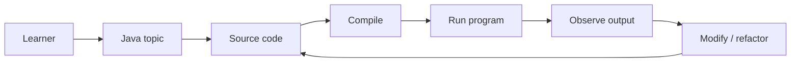
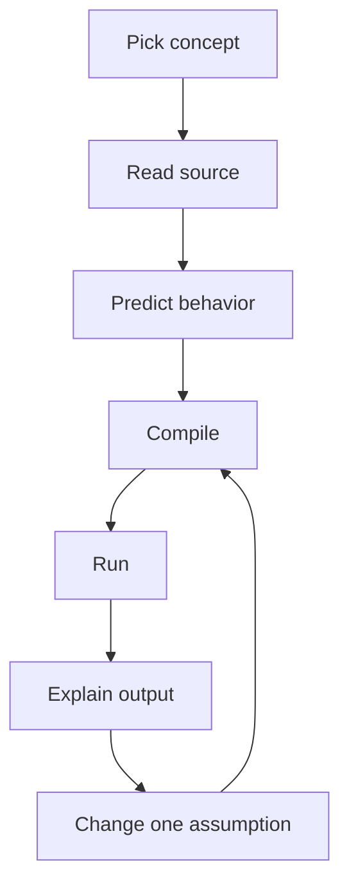
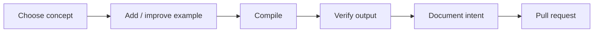

<div align="center">

# JavaStud

**A Java study repository for practicing language fundamentals, object-oriented programming, exercises, and small programs in a clear learning structure.**


[Browse source](https://github.com/Nischhalsubba/JavaStud/tree/master) · [Issues](https://github.com/Nischhalsubba/JavaStud/issues)

</div>

## Overview

**JavaStud** is intended as a Java learning and practice space. Developers can review examples quickly, learners can follow a repeatable study loop, and educators can use focused files as discussion material.

<details open>
<summary><strong>🧭 Interactive learning architecture</strong></summary>



</details>

## Learning flow



## Getting started

```bash
git clone https://github.com/Nischhalsubba/JavaStud.git
cd JavaStud
```

Use the Java version and build structure indicated by the source/project files. For standalone examples, compile and run the relevant class with a compatible JDK.

## For learners & developers

Prefer focused examples, descriptive package/class names, clear entry points, and comments that explain intent or non-obvious language behavior rather than narrating syntax.

## Discoverability

Use descriptive terms such as **Java examples, Java practice, Java fundamentals, object-oriented programming, Java classes, Java exercises, and Java study notes** where they accurately describe repository content.

## Contribution flow


